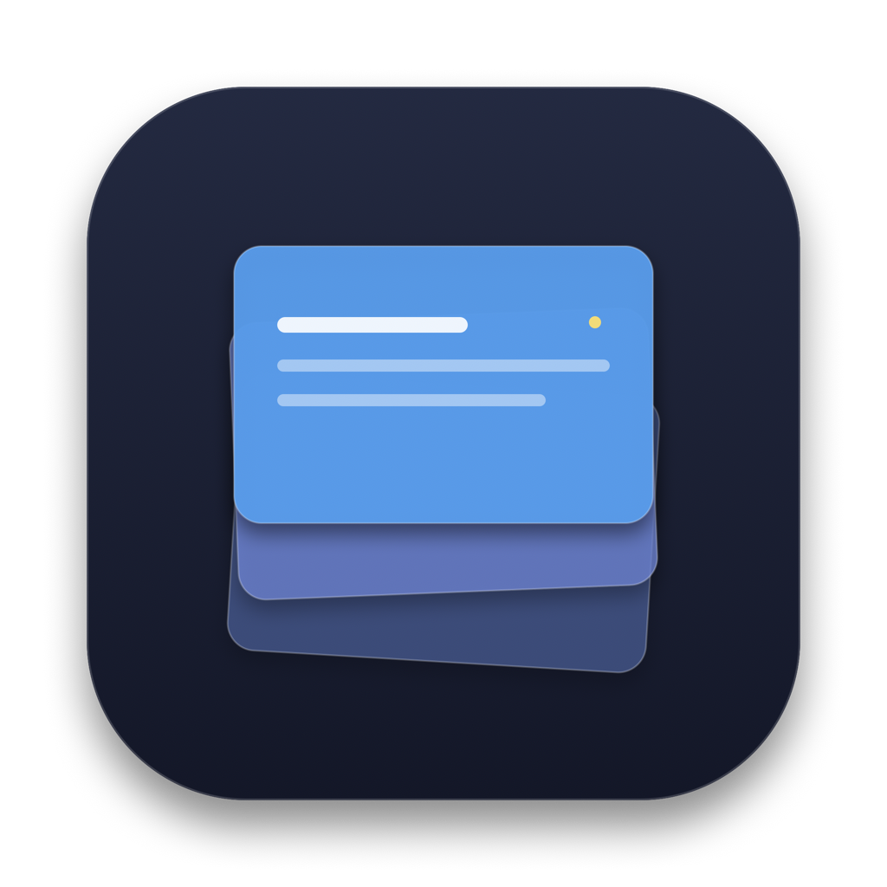

# 🥞 Stack — Gestionnaire de Presse-Papiers & Capture Défilante pour macOS

<p align="center">
  
</p>

<p align="center">
  <b>Un clone personnel, natif, ultra-fluide et moderne de l'application Paste pour macOS.</b><br>
  Surveillance continue du presse-papiers, tiroir translucide flottant, collage automatique instantané et captures d'écran défilantes de pages web complètes.
</p>

<p align="center">
  
  
  
  
  
</p>

---

## ✨ Fonctionnalités Principales

### 📋 1. Gestionnaire de Presse-Papiers Intelligent
- **Historique glissant (100 éléments)** : Conserve vos copies récentes dans un stockage local sécurisé (`~/Library/Application Support/Stack/`).
- **Détection automatique des formats** :
  - **Texte brut** & formaté.
  - **Code source** avec reconnaissance de syntaxe (*Swift, JavaScript/TypeScript, Python, SQL, Shell, JSON, HTML/CSS...*).
  - **URLs et Liens web** avec ouverture en un clic.
  - **Codes couleurs** (*Hex, RGB, HSL*) avec pastille visuelle interactive.
  - **Images** (PNG, JPEG, TIFF) avec aperçu haute définition.
- **Métadonnées de provenance** : Affiche l'icône et le nom de l'application d'origine (*Safari, Xcode, VS Code, Slack, Notes, etc.*) ainsi que l'heure relative (*« il y a 5 min »*).
- **Déduplication & Prévention de boucles** : Si vous recopiez un élément existant, il remonte au sommet sans créer de doublon.

### 🪟 2. Tiroir Flottant Élégant (HUD)
- **Design macOS moderne** : Fenêtre sans bordure avec effet de flou *Frosted Glass* (`.hudWindow` / `.ultraThinMaterial`), coins incurvés en *Apple Squircle* (rayon 26 px) et ombres natives.
- **Accès instantané par raccourci** : Appuyez sur **`⌘ + ⇧ + V`** à tout moment, depuis n'importe quel écran ou application.
- **Recherche en direct** : Champ de recherche textuelle immédiate pour retrouver n'importe quel extrait en une seconde.
- **Filtres par catégorie** : Puces de tri rapide (*Tous, Texte, Code, Liens, Images, Couleurs*).
- **Navigation au clavier** : Déplacement aux flèches, raccourcis rapides **`⌘1` à `⌘9`**, suppression par **`⌘ + ⌫`**, fermeture par **`Échap`** ou clic extérieur.

### ⚡ 3. Auto-Paste Automatique (Le Cœur de l'Expérience)
- Cliquez sur une carte ou appuyez sur **Entrée** :
  1. Stack place l'élément au sommet du presse-papiers système.
  2. Le tiroir se masque instantanément et redonne le focus à votre application précédente.
  3. Stack simule automatiquement la combinaison **`⌘ + V`** via `CGEvent` : **le contenu est collé directement dans votre curseur actif sans manipulation manuelle !**

### 📸 4. Capture Défilante de Page Entière (Scrolling Screenshot)
- Capturez l'intégralité d'un site web, d'un long fil de discussion ou d'un document en une seule image :
  - Déclenchez via **`⌘ + ⌥ + S`**, via la barre des menus ou depuis le bouton du tiroir.
  - **Sélectionnez la zone** à l'écran avec un rectangle de cadrage.
  - Cliquez sur **Démarrer** : la zone devient transparente et interactive, vous permettant de défiler librement avec votre trackpad ou molette.
  - Un bandeau flottant compact calcule la hauteur en temps réel (`Hauteur : 3 450 px`).
  - **Assemblage intelligent en direct (Stitching)** : Les nouvelles bandes de pixels sont analysées et cousues automatiquement sans doublons.
  - Cliquez sur **Terminer (Entrée)** : l'image complète est générée en Retina, copiée dans le presse-papiers et ajoutée à l'historique Stack avec le son de déclencheur photo !

### 🖼️ 5. Import Automatique des Captures macOS
- Surveillance automatique de vos dossiers de captures d'écran système (`~/Documents` ou `~/Desktop`).
- Toute capture prise avec `⌘ + ⇧ + 4` ou `⌘ + ⇧ + 3` est immédiatement indexée dans Stack.

---

## ⌨️ Raccourcis Clavier

| Raccourci | Action |
|---|---|
| **`⌘ + ⇧ + V`** | Ouvrir / Masquer le tiroir Stack |
| **`⌘ + ⌥ + S`** | Lancer la Capture Défilante (Scrolling Screenshot) |
| **`←` / `→`** | Naviguer entre les cartes d'historique |
| **`Entrée` (`↵`)** | Coller l'élément sélectionné dans l'application active |
| **`⌘1` – `⌘9`** | Coller directement l'un des 9 premiers éléments |
| **`⌘ + ⌫`** | Supprimer l'élément sélectionné de l'historique |
| **`Échap` (`⎋`)** | Fermer le tiroir ou annuler la capture en cours |

---

## 🔒 Confidentialité & Sécurité (100% Local-First)

Stack est conçu dans le respect absolu de la vie privée :
- 🛡️ **Aucune connexion réseau** : L'application n'inclut aucun tracker, aucune télémétrie et n'effectue aucune requête sortante.
- 💾 **Données stockées localement** : Tout votre historique reste exclusivement sur votre machine dans `~/Library/Application Support/Stack/`.
- 🚫 **Zéro framework publicitaire ou tiers** : Construit uniquement avec les frameworks officiels d'Apple (*AppKit, SwiftUI, CoreGraphics, Carbon*).

---

## 🚀 Installation & Compilation

### Prérequis
- **macOS 13.0 (Ventura)** ou version ultérieure (Sonoma, Sequoia).
- **Xcode Command Line Tools** ou **Xcode 15+** avec Swift 6 installé.

### Compilation et Installation en 1 ligne

Clonez le dépôt et lancez le script de compilation :

```bash
git clone https://github.com/Julien-Costa-Castro/Stack.git
cd Stack
chmod +x build.sh
./build.sh --install --run
```

Le script :
1. Compile le projet en mode Release (`swift build -c release`).
2. Construit l'arborescence native `Stack.app/Contents/{MacOS,Resources}`.
3. Génère le fichier `Info.plist` (mode arrière-plan sans icône Dock `LSUIElement = true`).
4. Signe ad-hoc le bundle avec un identifiant stable (`com.stack.app`).
5. Déploie l'application dans votre dossier `/Applications` et la lance.

---

## 🛡️ Configuration des Permissions macOS

Pour fonctionner à plein potentiel, Stack a besoin de deux autorisations système :

### 1. Accessibilité (Pour le collage automatique `⌘ + V`)
1. Ouvrez **Réglages Système** ➔ **Confidentialité et sécurité** ➔ **Accessibilité**.
2. **Astuce macOS** : Les applications d'arrière-plan sans icône Dock (`LSUIElement = true`) peuvent être ignorées par le bouton `+` des Réglages Système.
   👉 **Faites simplement glisser `Stack.app` depuis votre dossier Applications dans la liste d'Accessibilité**, puis validez avec votre Touch ID / mot de passe.
   *(Vous pouvez aussi cliquer sur « Permissions Accessibilité... » dans le menu de la barre des menus pour ouvrir le dossier et les réglages côte à côte).*

### 2. Enregistrement de l'écran (Pour la Capture Défilante)
Lors du premier lancement d'une capture défilante (`⌘ + ⌥ + S`), macOS vous demandera l'autorisation d'accéder à l'enregistrement de l'écran. Activez l'interrupteur pour **Stack** dans **Réglages Système ➔ Confidentialité et sécurité ➔ Enregistrement de l'écran**.

---

## 📁 Architecture du Code

```
Stack/
├── Package.swift                     # Manifeste Swift Package Manager (macOS 13+)
├── build.sh                          # Script de compilation, packaging .app et signature ad-hoc
├── LICENSE                           # Licence MIT
├── README.md                         # Documentation complète
├── Resources/
│   └── AppIcon.icns                  # Icône macOS haute résolution
└── Sources/
    └── Stack/
        ├── App/
        │   ├── AppDelegate.swift     # Initialisation du cycle de vie NSApplication
        │   └── main.swift            # Point d'entrée exécutable
        ├── HotKey/
        │   └── GlobalHotKeyManager.swift # Gestionnaire de raccourcis globaux Carbon (⌘⇧V, ⌘⌥S)
        ├── Models/
        │   └── ClipboardItem.swift   # Modèle de données, formats, détection de code & métadonnées
        ├── ScrollingCapture/
        │   ├── ImageStitcher.swift   # Algorithme d'assemblage d'images vertical en direct
        │   ├── ScrollHUDWindow.swift # Bandeau de contrôle flottant & cadre indicateur
        │   ├── ScrollingCaptureController.swift # Orchestrateur de capture défilante
        │   ├── SelectionOverlayView.swift # Vue interactive de tracé du rectangle
        │   └── SelectionOverlayWindow.swift # Fenêtre plein écran de sélection
        ├── Simulation/
        │   └── KeySimulator.swift    # Injection d'événements clavier CGEvent & vérification TCC
        ├── StatusBar/
        │   └── StatusBarController.swift # Icône MenuBar avec menu contextuel et actions
        ├── Storage/
        │   └── ClipboardStorage.swift # Persistance locale (JSON + cache PNG haute fidélité)
        ├── UI/
        │   ├── FloatingPanel.swift   # Fenêtre NSPanel HUD translucide & interception clavier
        │   ├── HUDViewModel.swift    # ViewModel Observable (recherche, filtres, sélection)
        │   ├── HUDWindowController.swift # Positionnement dynamique, transitions & masquage
        │   └── Views/
        │       ├── CardView.swift    # Cartes visuelles de contenu (texte, code, images, etc.)
        │       ├── EmptyStateView.swift # Écran d'état vide
        │       ├── FilterChipView.swift # Puces de filtrage horizontal
        │       ├── HUDView.swift     # Vue principale avec coins continus et flou frosted glass
        │       ├── PermissionBanner.swift # Bandeau d'assistance aux permissions
        │       └── SearchBarView.swift    # Barre de recherche réactive
        └── Watcher/
            ├── ClipboardWatcher.swift # Polling pasteboard (250ms) avec prévention de boucles
            └── ScreenshotWatcher.swift # Surveillance et import des captures système
```

---

## 📄 Licence

Ce projet est distribué sous licence **MIT**. Vous êtes libre de l'utiliser, le modifier et le distribuer pour vos propres besoins. Voir le fichier [LICENSE](LICENSE) pour plus de détails.
